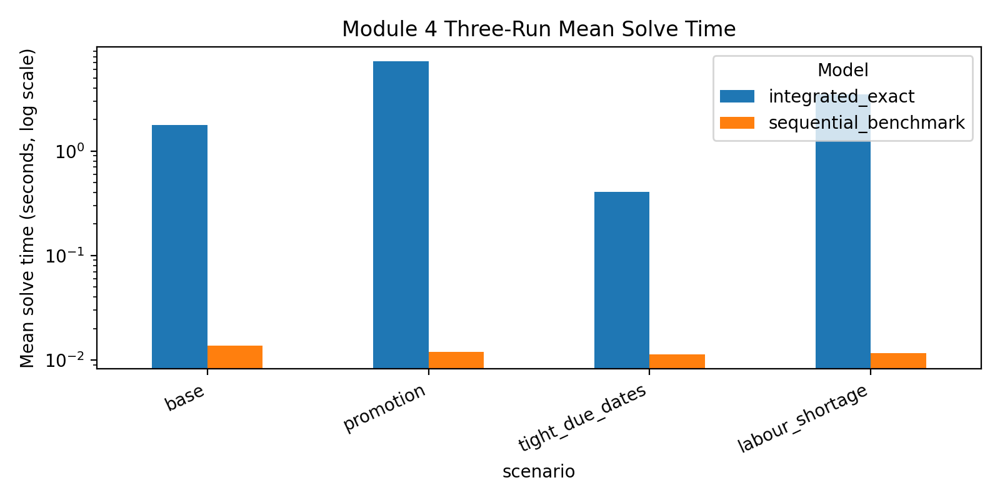
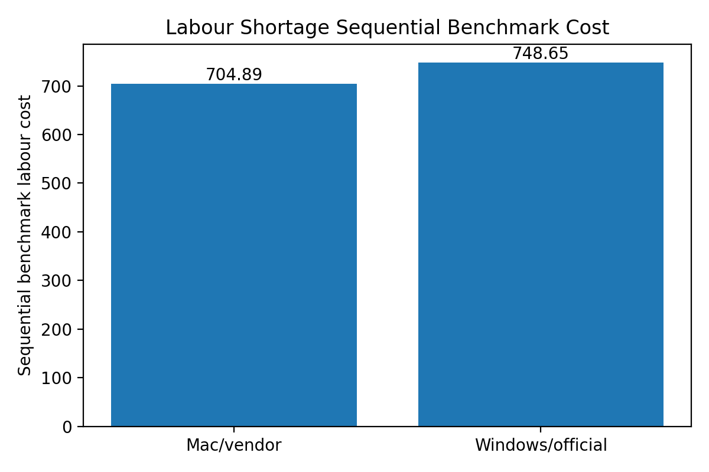

# Optimization Solver Reproducibility and Validation

This repository is a personal optimisation engineering project focused on solver reproducibility, validation auditing, and cross-environment result diagnosis.

The project investigates why a two-stage sequential optimisation benchmark can produce different downstream labour costs across solver environments, even when repeated runs are internally stable and validation checks pass.

It is positioned for business algorithm, operations research, and data science internship applications, where model correctness, reproducibility, and explainable diagnostics matter as much as the final objective value.

## Problem

The optimisation pipeline compares multiple fulfilment planning scenarios and model variants.

During cross-environment validation, one scenario showed a discrepancy:

| Benchmark | macOS vendored Gurobi | Windows official Gurobi | Difference |
|---|---:|---:|---:|
| labour shortage sequential benchmark cost | 704.89 | 748.65 | 43.76 |

Other scenarios and integrated model outputs were stable. The goal was to determine whether this was a modelling error, validation failure, solver instability, or deterministic tie-breaking issue.

## Method

The analysis workflow includes:

1. Implement and compare integrated and two-stage sequential optimisation benchmarks.
2. Run repeated consistency checks across scenarios and model variants.
3. Summarise solve-time stability across repeated runs.
4. Audit validation outputs for constraint violations.
5. Compare macOS vendored-Gurobi and Windows official-Gurobi outputs.
6. Diagnose the labour-shortage sequential benchmark discrepancy.
7. Trace the downstream cost gap to staffing decisions and equivalent Stage-1 release plans.

## Key Results

| Check | Result |
|---|---|
| Windows repeated runs | Stable across three runs |
| Validation audit | 72 / 72 checks passed in both environments |
| Stage-1 objective | Same value in both environments: 534.8 |
| Cost difference | 43.76 |
| Source of difference | 2 extra temporary-worker hours |
| Interpretation | Cross-environment tie-breaking sensitivity in a two-stage sequential benchmark |

The cost difference is exactly explained by:

```text
2 temporary-worker hours * 21.88 = 43.76
```

This suggests the environments selected different Stage-1-equivalent release plans, which then led to different Stage-2 staffing costs.

## Portfolio Takeaways

- Built a reproducibility audit for optimisation outputs across solver environments.
- Designed validation summaries for constraint checks and repeated-run stability.
- Diagnosed a cross-environment discrepancy without changing the core optimisation model.
- Produced clean CSV tables, figures, memo text, and report-ready findings.
- Recommended deterministic tie-breaking for strict cross-machine reproducibility.
- Packaged the analysis as a reusable validation workflow for optimisation projects.

## Repository Structure

```text
.
├── csv/          # Cleaned validation and comparison tables
├── figures/      # Visual summaries
├── raw_outputs/  # Source scripts and raw comparison/validation outputs
├── scripts/      # Output generation and post-processing script
├── docs/         # Memo, report section, and slide summary
└── README.md
```

## Selected Outputs

### Solve-time comparison



### Labour-shortage cost comparison



## How to Reproduce the Clean Outputs

The cleaned CSV and figure outputs can be regenerated from `raw_outputs/`:

```bash
python scripts/generate_module4_outputs.py
```

The checked-in `csv/` and `figures/` folders are generated from the source comparison and validation files in `raw_outputs/`.

## Main Files

| File | Purpose |
|---|---|
| `raw_outputs/models.py` | Optimisation model implementation used by the benchmark |
| `raw_outputs/experiments.py` | Scenario experiment runner |
| `scripts/generate_module4_outputs.py` | Post-processing script for validation tables and figures |
| `csv/module4_validation_audit.csv` | Constraint validation audit summary |
| `csv/module4_mac_vs_windows_kpi_comparison.csv` | Cross-environment KPI comparison |
| `csv/module4_stage1_objective_diagnostic.csv` | Stage-1 objective diagnostic |
| `docs/reproducibility_validation_memo.md` | Memo-style explanation of the key finding |

## Tech Stack

Python, Pandas, Matplotlib, Gurobi-style optimisation modeling, validation auditing, reproducibility diagnostics.
