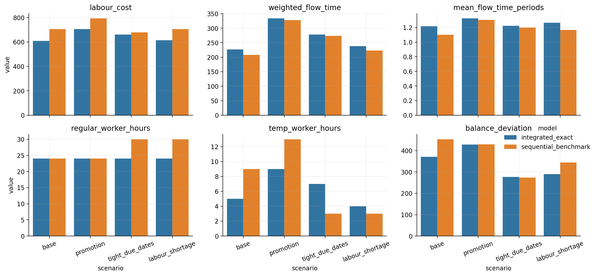
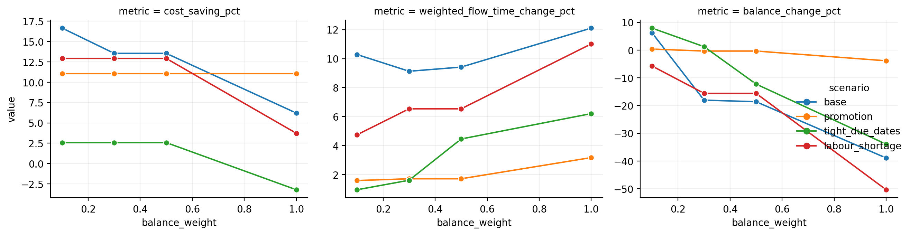
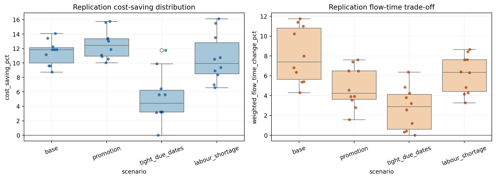

# Joint Wave Planning and Workforce Scheduling for E-Commerce Fulfilment: A Mixed-Integer Programming Study

## Abstract

This study considers a department-level planning problem in e-commerce fulfilment. Orders arrive during the day, must be assigned to release waves, and generate coupled picking and packing workloads under limited labour capacity. We formulate an integrated mixed-integer programming model that jointly determines order-to-wave assignments, wave activations, regular staffing, temporary labour, overtime, and the allocation of available workers between picking and packing. The model is calibrated from public industrial and academic sources, while order-level micro-data are generated with fixed random seeds. The integrated model is evaluated against a strong two-stage exact benchmark that first determines wave releases and then staffs the resulting workload profile. In four baseline scenarios, the integrated model is solved to proven optimality, maintains zero late orders, and reduces labour cost by `2.58%` to `13.55%`. A replication study with `40` additional feasible instances shows that the integrated model is cheaper in `39` cases and remains zero-late in all `40`. Sensitivity and service-robustness analyses indicate that joint planning yields a stable trade-off between labour efficiency, flow time, and workload smoothing.

## 1. Introduction

E-commerce fulfilment operations face a structurally difficult planning problem: a large number of small and time-critical orders must be processed quickly, but labour capacity remains lumpy, finite, and costly. In picker-to-parts environments, operational performance depends not only on which orders are released to the floor, but also on how the available workforce is deployed across sequential processes such as picking and packing. Existing warehouse research has repeatedly shown that order picking is one of the most labour-intensive warehouse functions and that isolated optimisation of subproblems can lead to globally inferior operating plans [1,2].

The e-commerce context intensifies this challenge. Boysen, de Koster, and Weidinger emphasise that online retail warehouses must process large numbers of small orders with tight delivery schedules and volatile workloads [3]. Li, Zhang, and Jiang similarly note that e-commerce order-picking systems are characterised by small order sizes, service sensitivity, and growing pressure to integrate multiple planning decisions [4]. Van Gils, Ramaekers, Caris, and Braekers further argue that combining operational planning problems is often necessary because sequential optimisation may overlook critical interdependencies [5].

This study is motivated by a concrete operational question: should order-wave planning and labour planning be solved jointly or sequentially in a fulfilment department? Related literature suggests that integration can be valuable. Van Gils, Caris, Ramaekers, and Braekers demonstrate the benefits of integrating batching, routing, and picker scheduling in a real spare-parts warehouse [6]. Muter and Öncan study integrated order batching and picker scheduling in wave-picking systems [7]. Zhong et al. show that integrating picking and packing planning can improve overall warehouse performance relative to non-integrated methods [8]. Mou highlights the importance of explicitly accounting for workforce flexibility and skill heterogeneity in order-picking systems [9]. These studies all reinforce the same theme: operational stages that are physically and temporally coupled should also be analytically coupled.

The setting is a single picking-and-packing department inside a larger fulfilment centre. The department operates over `12` hourly periods and must plan both order releases and labour usage. The study makes four contributions.

1. It develops a transparent department-level dataset calibrated from public industry and academic sources.
2. It formulates an integrated mixed-integer programming model that jointly captures release timing and workforce decisions.
3. It constructs a strong two-stage exact benchmark to isolate the value of integration.
4. It provides point-performance comparisons, service-robustness diagnostics, objective-weight sensitivity analysis, and a multi-instance replication study.

The remainder of the report proceeds as follows. Section 2 formalises the operational setting. Section 3 documents the data construction and calibration logic. Section 4 presents the integrated formulation and the benchmark. Section 5 explains the computational design and validation framework. Section 6 reports the main results and extended analysis. Section 7 discusses managerial implications, limitations, and future work. Section 8 concludes.

## 2. Problem Setting and Operational Motivation

We study one fulfilment department within a larger e-commerce warehouse. The department handles order release, picking, and packing for a subset of the warehouse workload over a single operating day.

The planning horizon is divided into `12` hourly periods. Orders arrive during the day and must be assigned to one release wave. Releasing a wave in period `t` creates:

- picking workload in period `t`
- packing workload in period `t + 1`

This one-period lag is a stylised but operationally meaningful simplification of the physical process by which items are first retrieved and then consolidated and packed for dispatch. It implies that the final period cannot release a new wave because no subsequent packing period exists.

The manager must decide:

- which release period to assign to each order
- whether to open a wave in each releasable period
- how many regular workers to activate on each shift template
- how many temporary and overtime workers to use in each period
- how many available workers to allocate to picking and packing

This structure is particularly suitable for wave-based departments in which managerial decisions are still made at an aggregate level rather than at the level of individual picker routes. It is also consistent with the literature on integrated order picking problems, which often focuses on batch formation, scheduling, and labour deployment rather than on continuous-time micro-control [5,6,7].

## 3. Data Construction and Calibration

### 3.1 Public Sources and Data Policy

The study does not use proprietary order logs from a live fulfilment centre. Instead, it uses a hybrid data strategy:

- public sources for macro-level calibration
- transparent synthetic generation for micro-level order data
- fixed random seeds for full reproducibility

This choice keeps the assumptions auditable and the empirical scope consistent with the data that are actually available.

The calibration sources are:

1. Amazon, *Our Facilities* [11]
2. Amazon, *How does your Amazon order get to your doorstep?* [12]
3. Zalando Research, `batching-benchmarks` repository [14]
4. Li, Zhang, and Jiang, review of e-commerce order-picking efficiency [4]
5. U.S. Bureau of Labor Statistics, `Stockers and Order Fillers` occupational wage data [13]

### 3.2 Why the Department-Level Scale Is Appropriate

Amazon publicly describes sortable fulfilment centres as facilities of roughly `800,000` square feet with more than `1,500` full-time associates [11]. A facility-wide exact MIP at that scale would require detailed proprietary event logs and a much richer operational state description than are publicly available. The model therefore represents a **department-level planning cell** inside a larger building.

Under this interpretation, order counts in the `120` to `145` range represent the daily tactical load of one department, pod, or fulfilment segment rather than the entire warehouse. This avoids mixing facility-level descriptions with incompatible micro-scale optimisation instances.

### 3.3 Dataset Description

Each scenario is represented by three linked tables.

| Table | Unit of observation | Rows per scenario | Main fields | Role in the model |
|---|---|---:|---|---|
| `orders` | order | `120` to `145` | arrival period, due period, service class, item count, zones touched, total volume, picking minutes, packing minutes, priority weight, flow-time weight | defines demand and order-specific workload |
| `periods` | hourly period | `12` | release eligibility, wave volume capacity, wave order-count capacity, temporary-labour bound, overtime bound | defines period-level capacity and staffing limits |
| `shifts` | shift template | `4` | start period, end period, length, maximum workers, cost per worker, coverage vector | defines regular staffing structure |

The `orders` table is the central dataset. It contains one row per order and all attributes needed by the release and staffing models. The `periods` and `shifts` tables encode the planning environment and are common to all orders within a scenario.

### 3.4 Instance Generation

Each order record contains:

- arrival period
- due period
- service class
- priority weight
- flow-time weight
- item count
- zones touched
- total volume
- picking minutes
- packing minutes

The item-count distribution is calibrated to remain close to the small-order structure documented in the e-commerce literature. Boysen et al. report that e-commerce orders may contain very few items, citing an average of `1.6` items in German Amazon warehouses [3]. Li et al. likewise discuss the prevalence of small line counts in e-commerce environments [4]. In our generated scenarios, the average item count ranges from `2.112` to `2.145`, which is consistent with that operational picture.

Picking and packing times are generated from interpretable rules:

- picking time increases with item count, zones touched, and total volume
- packing time depends on the same drivers but more weakly

This ensures heterogeneous but understandable orders. The time models do not attempt to reconstruct detailed walking routes or ergonomics. Instead, they embed these effects into calibrated workload minutes, which is suitable for department-level tactical planning.

To make the generated data concrete, the four baseline scenarios contain `510` orders in total. Each instance spans `12` periods and uses `4` regular shift templates. Across the four baseline scenarios, average order size lies between `2.112` and `2.145` items, and total daily workload lies between `1182.61` and `1456.86` minutes.

### 3.5 Labour Cost Calibration

Regular labour cost uses the BLS hourly wage benchmark for stockers and order fillers [13]. The model then applies transparent premiums for flexible labour:

- regular labour: `17.50` per hour
- temporary labour: `21.88` per hour
- overtime labour: `26.25` per hour

This creates an interpretable cost hierarchy: regular shifts are cheapest per hour but come in multi-hour blocks; temporary and overtime labour are more expensive but flexible.

### 3.6 Scenario Set

The final experimental design includes four deterministic scenarios.

| Scenario | Orders | Avg items/order | Avg pick min/order | Avg pack min/order | Avg SLA width | Total workload (min) |
|---|---:|---:|---:|---:|---:|---:|
| base | 120 | 2.142 | 6.966 | 3.010 | 3.750 | 1197.07 |
| promotion | 145 | 2.145 | 7.002 | 3.045 | 2.966 | 1456.86 |
| tight_due_dates | 125 | 2.112 | 6.857 | 2.989 | 2.096 | 1230.72 |
| labour_shortage | 120 | 2.117 | 6.872 | 2.983 | 3.633 | 1182.61 |

The four scenarios are designed to test different stress mechanisms:

- `base`: nominal day
- `promotion`: heavier demand and denser urgent arrivals
- `tight_due_dates`: service windows are narrower
- `labour_shortage`: recourse labour and regular capacity are more constrained

## 4. Mathematical Models

### 4.1 Sets

- `I`: set of orders
- `T = {0,1,...,11}`: set of planning periods
- `R = {0,1,...,10}`: set of releasable periods
- `S`: set of regular shift templates
- `R_i subseteq R`: candidate release periods for order `i`

### 4.2 Parameters

| Symbol | Meaning |
|---|---|
| `a_i` | arrival period of order `i` |
| `d_i` | due period of order `i` |
| `v_i` | total volume of order `i` |
| `p_i` | picking workload minutes of order `i` |
| `q_i` | packing workload minutes of order `i` |
| `w_i^T` | tardiness priority weight of order `i` |
| `w_i^F` | flow-time weight of order `i` |
| `C_t` | wave volume capacity in period `t` |
| `N_t` | wave order-count capacity in period `t` |
| `A_{st}` | coverage of shift `s` in period `t` |
| `c_s^R` | cost of one regular worker on shift `s` |
| `c^T` | cost of one temporary worker-hour |
| `c^O` | cost of one overtime worker-hour |
| `c^Y` | cost of opening one wave |
| `U_t^T` | temporary labour upper bound in period `t` |
| `U_t^O` | overtime labour upper bound in period `t` |
| `Pcap` | picking capacity per worker per period |
| `Qcap` | packing capacity per worker per period |
| `Wbar` | average total workload across all periods |
| `α` | weight on weighted tardiness in the objective |
| `β` | weight on weighted flow time in the objective |
| `γ` | weight on workload-balance deviation in the objective |

### 4.3 Decision Variables

| Variable | Meaning |
|---|---|
| `x_it in {0,1}` | 1 if order `i` is released in period `t` |
| `y_t in {0,1}` | 1 if a wave is opened in period `t` |
| `r_s in Z_+` | regular workers activated on shift `s` |
| `k_t in Z_+` | picking workers in period `t` |
| `m_t in Z_+` | packing workers in period `t` |
| `u_t in Z_+` | temporary workers in period `t` |
| `o_t in Z_+` | overtime workers in period `t` |
| `L_i >= 0` | tardiness of order `i` |
| `b_t^+, b_t^- >= 0` | workload-imbalance deviations in period `t` |

### 4.4 Integrated Model

Picking and packing workloads are defined by:

```math
PickLoad_t = \sum_{i \in I : t \in R_i} p_i x_{it}
```

```math
PackLoad_t =
\begin{cases}
0, & t = 0, \\
\sum_{i \in I : t-1 \in R_i} q_i x_{i,t-1}, & t \ge 1.
\end{cases}
```

The integrated model is:

```math
\min
\alpha \sum_{i \in I} w_i^T L_i
+ \beta \sum_{i \in I}\sum_{t \in R_i} w_i^F(t+1-a_i)x_{it}
+ \sum_{s \in S} c_s^R r_s
+ \sum_{t \in T} c^T u_t
+ \sum_{t \in T} c^O o_t
+ \sum_{t \in R} c^Y y_t
+ \gamma \sum_{t \in T}(b_t^+ + b_t^-)
```

where `α` weights weighted tardiness, `β` weights weighted flow time, and `γ` weights workload-balance deviation. Unless otherwise stated, `α = 10000`, `β = 2`, and `γ = 0.3`. The value of `α` is chosen to make service failure dominant in the objective. The weight `β` discourages unnecessarily late but still on-time releases. The weight `γ` controls the strength of workload smoothing.

Subject to:

1. Exact assignment

```math
\sum_{t \in R_i} x_{it} = 1 \qquad \forall i \in I
```

2. Wave volume capacity

```math
\sum_{i \in I : t \in R_i} v_i x_{it} \le C_t y_t \qquad \forall t \in R
```

3. Wave order-count capacity

```math
\sum_{i \in I : t \in R_i} x_{it} \le N_t y_t \qquad \forall t \in R
```

4. Picking capacity

```math
PickLoad_t \le Pcap \cdot k_t \qquad \forall t \in T
```

5. Packing capacity

```math
PackLoad_t \le Qcap \cdot m_t \qquad \forall t \in T
```

6. Labour availability

```math
k_t + m_t \le \sum_{s \in S} A_{st}r_s + u_t + o_t \qquad \forall t \in T
```

7. Tardiness definition

```math
L_i \ge \sum_{t \in R_i}(t+1)x_{it} - d_i \qquad \forall i \in I
```

8. Balance definition

```math
PickLoad_t + PackLoad_t - Wbar = b_t^+ - b_t^- \qquad \forall t \in T
```

9. Labour bounds

```math
0 \le u_t \le U_t^T,\quad 0 \le o_t \le U_t^O,\quad
r_s,k_t,m_t,u_t,o_t \in \mathbb{Z}_+
```

The objective is hierarchical in effect. Tardiness dominates all lower-order considerations. Conditional on zero tardiness, the model trades off flow time, labour cost, and workload balance.

### 4.5 Sequential Benchmark

To isolate the value of integration, we construct a two-stage exact benchmark.

**Stage 1: wave planning**

```math
\min
\alpha \sum_{i \in I} w_i^T L_i
+ \beta \sum_{i \in I}\sum_{t \in R_i} w_i^F(t+1-a_i)x_{it}
+ \sum_{t \in R} c^Y y_t
```

subject to the assignment, wave-capacity, and tardiness-definition constraints.

**Stage 2: staffing**

Given the wave assignments from Stage 1, solve:

```math
\min
\sum_{s \in S} c_s^R r_s
+ \sum_{t \in T} c^T u_t
+ \sum_{t \in T} c^O o_t
+ \gamma \sum_{t \in T}(b_t^+ + b_t^-)
```

subject to the resulting picking and packing workloads and the labour-capacity constraints.

Both stages are solved exactly. Any improvement achieved by the integrated model therefore reflects the value of coupling the decisions rather than weakness in the comparator.

### 4.6 Solution Strategy

All models are implemented in Python with the `gurobipy` API and solved with Gurobi [15]. The implementation uses:

- exact MIP solving
- deterministic seeds
- single-thread execution for reproducibility
- warm starts from the benchmark solution to the integrated model

An additional valid reduction is used. If the benchmark proves that zero tardiness is feasible, then tardy release candidates are removed from the integrated search because the tardiness penalty is overwhelmingly large. This accelerates proof of optimality without changing the true optimum.

## 5. Computational Design and Validation

### 5.1 Performance Metrics

The empirical study evaluates:

- labour cost
- weighted flow time
- mean flow time
- late orders
- regular, temporary, and overtime worker-hours
- workload-balance deviation
- active waves
- residual slack at completion
- solve time

Late orders are retained as a service-feasibility metric rather than as a main plotting KPI because all final policies achieve zero lateness.

### 5.2 Validation Framework

Every generated solution is checked against:

- unique assignment of every order
- no release before arrival
- release-window consistency
- wave volume capacity
- wave order-count capacity
- picking capacity
- packing capacity
- worker-balance feasibility
- tardiness-definition consistency

The final validation output records `72/72` zero-violation checks.

### 5.3 Replication-Study Design

The four baseline scenarios provide controlled point comparisons, but they are not sufficient on their own. The analysis therefore includes a replication study with `10` independently seeded instances for each scenario family, for a total of `40` instances.

The replication protocol is deterministic and auditable:

- each scenario family keeps the same structural parameters
- order-level randomness is changed by an explicit seed override
- both the sequential benchmark and the integrated model are solved exactly on every retained replication

One additional rule is needed for the `tight_due_dates` family. Some raw random draws create structurally infeasible instances because customer promises can become too tight relative to the fixed department capacities. Rather than silently dropping such cases, the experiment uses a **feasibility-screened deterministic seed sequence**: for each replication id, we retain the first seed in a fixed ordered sequence that yields a feasible exact benchmark. The mean number of such resamples is reported in the final table. This keeps the replication study transparent while ensuring that all retained instances correspond to operationally admissible planning problems.

## 6. Results and Analysis

### 6.1 Main Comparative Results

Table 1 reports the central comparison between the integrated model and the sequential benchmark.

| Scenario | Sequential cost | Integrated cost | Cost saving % | Weighted flow-time change % | Balance change % | Late orders | Integrated solve time (s) |
|---|---:|---:|---:|---:|---:|---:|---:|
| base | 704.92 | 609.40 | 13.55% | +9.13% | -18.06% | 0 | 2.33 |
| promotion | 792.44 | 704.92 | 11.04% | +1.71% | -0.36% | 0 | 3.78 |
| tight_due_dates | 678.64 | 661.16 | 2.58% | +1.61% | +1.21% | 0 | 0.37 |
| labour_shortage | 704.89 | 613.77 | 12.93% | +6.54% | -15.62% | 0 | 5.21 |

Three features deserve emphasis.

First, the integrated model is solved to `OPTIMAL` in every scenario. Second, all integrated solutions keep zero late orders. Third, the integrated model lowers labour cost in every scenario.

This does **not** mean that the integrated model dominates the benchmark on every single KPI. Weighted flow time rises slightly in all scenarios. That is not a modelling error. It reflects the economic structure of the objective: once the model has found a zero-tardiness plan, it may delay some orders modestly within their feasible service windows to obtain a cheaper and often smoother staffing plan.



### 6.2 Service Robustness Beyond Zero Tardiness

Because `late_orders = 0` in all scenarios, we also analyse **residual slack at completion**. This provides a more discriminating service-quality view.

| Scenario | Model | Mean residual slack | Share with slack <= 1 | Share exactly on due date |
|---|---|---:|---:|---:|
| base | integrated | 2.533 | 0.217 | 0.108 |
| base | sequential | 2.650 | 0.183 | 0.042 |
| promotion | integrated | 1.641 | 0.428 | 0.124 |
| promotion | sequential | 1.662 | 0.414 | 0.117 |
| tight_due_dates | integrated | 0.872 | 0.808 | 0.336 |
| tight_due_dates | sequential | 0.896 | 0.776 | 0.344 |
| labour_shortage | integrated | 2.367 | 0.167 | 0.075 |
| labour_shortage | sequential | 2.467 | 0.167 | 0.025 |

This table clarifies the service trade-off. The integrated model usually consumes slightly more slack than the benchmark, but all orders remain on time and the minimum residual slack is never negative. In other words, the model is not causing service failure; it is using part of the available service buffer to reduce staffing cost.

The tight-due-date scenario is particularly informative. Its mean residual slack under the integrated model is only `0.872` periods, confirming that the environment is genuinely tight rather than trivially over-capacitated. This strengthens the credibility of the scenario design.

### 6.3 Operational Mechanisms Behind the Savings

The integrated model reduces labour cost through different mechanisms in different scenarios.

| Scenario | Model | Active waves | Regular hours | Temp hours | Overtime hours |
|---|---|---:|---:|---:|---:|
| base | integrated | 10 | 24 | 5 | 0 |
| base | sequential | 11 | 24 | 9 | 0 |
| promotion | integrated | 11 | 24 | 9 | 0 |
| promotion | sequential | 11 | 24 | 13 | 0 |
| tight_due_dates | integrated | 11 | 24 | 7 | 0 |
| tight_due_dates | sequential | 11 | 30 | 3 | 0 |
| labour_shortage | integrated | 10 | 24 | 4 | 1 |
| labour_shortage | sequential | 11 | 30 | 3 | 1 |

These results show that the savings do not come from a single universal mechanism.

- In `base` and `promotion`, the main gain comes from reducing temporary labour while holding regular hours constant.
- In `tight_due_dates` and `labour_shortage`, the integrated model reduces regular hours by `6` while partially compensating with more flexible labour.
- In `base` and `labour_shortage`, the integrated model also uses fewer active waves.

This heterogeneity is important. It suggests that integrated planning does not impose a rigid policy, but rather adapts the release-and-staffing pattern to the dominant source of operational pressure.

### 6.4 Balance and Utilisation

Workload-balance performance improves in three of the four scenarios. The largest balance gains occur in:

- `base`: `-18.06%`
- `labour_shortage`: `-15.62%`

The one exception is `tight_due_dates`, where balance worsens slightly by `+1.21%`. This is a plausible result rather than a defect. When service windows become narrow, the feasible region shrinks and the model has less freedom to smooth workload without violating due dates or increasing labour cost sharply.

Wave-utilisation statistics also support the operational interpretation. In `base` and `labour_shortage`, the integrated model reduces active waves while maintaining high utilisation of the remaining waves. In `promotion`, both methods require the same number of waves, but the integrated model still saves labour by shaping staffing more effectively around the workload profile.

### 6.5 Objective-Weight Sensitivity Analysis

To justify the chosen balance weight `γ = 0.3`, we ran a sensitivity analysis over `γ in {0.1, 0.3, 0.5, 1.0}`.

Key results:

- At `γ = 0.1`, cost savings are highest in `base`, but balance worsens in `base`, `promotion`, and `tight_due_dates`.
- At `γ = 1.0`, balance improves strongly, but cost performance deteriorates sharply. In `tight_due_dates`, the integrated model becomes more expensive than the benchmark.
- `γ = 0.3` preserves positive labour-cost savings in all scenarios and improves balance in three of the four.

The sensitivity table is:

| Balance weight | Scenario | Cost saving % | Weighted flow-time change % | Balance change % | Integrated status |
|---:|---|---:|---:|---:|---|
| 0.1 | base | 16.65 | +10.28 | +6.20 | OPTIMAL |
| 0.1 | promotion | 11.04 | +1.58 | +0.35 | OPTIMAL |
| 0.1 | tight_due_dates | 2.58 | +0.95 | +7.91 | OPTIMAL |
| 0.1 | labour_shortage | 12.93 | +4.74 | -5.75 | OPTIMAL |
| 0.3 | base | 13.55 | +9.13 | -18.06 | OPTIMAL |
| 0.3 | promotion | 11.04 | +1.71 | -0.36 | OPTIMAL |
| 0.3 | tight_due_dates | 2.58 | +1.61 | +1.21 | OPTIMAL |
| 0.3 | labour_shortage | 12.93 | +6.54 | -15.62 | OPTIMAL |
| 0.5 | base | 13.55 | +9.41 | -18.63 | OPTIMAL |
| 0.5 | promotion | 11.04 | +1.71 | -0.36 | OPTIMAL |
| 0.5 | tight_due_dates | 2.58 | +4.45 | -12.26 | OPTIMAL |
| 0.5 | labour_shortage | 12.93 | +6.54 | -15.62 | OPTIMAL |
| 1.0 | base | 6.21 | +12.10 | -38.92 | OPTIMAL |
| 1.0 | promotion | 11.04 | +3.17 | -3.87 | OPTIMAL |
| 1.0 | tight_due_dates | -3.22 | +6.20 | -33.94 | OPTIMAL |
| 1.0 | labour_shortage | 3.72 | +11.01 | -50.36 | OPTIMAL |

From a modelling perspective, `γ = 0.3` is therefore a reasonable compromise. It avoids the under-balanced plans associated with `γ = 0.1` and the over-smoothed, cost-damaging behaviour associated with `γ = 1.0`.



### 6.6 Multi-Instance Replication Study

The replication study extends the analysis beyond four single instances to `40` independently generated planning problems.

| Scenario family | Replications | Mean cost saving % | 95% bootstrap CI | Share integrated cheaper | Sign-test p-value | Mean weighted flow-time change % | Mean balance change % | Share zero-late integrated | Mean feasibility resamples |
|---|---:|---:|---:|---:|---:|---:|---:|---:|---:|
| base | 10 | 11.451 | [10.463, 12.458] | 1.00 | 0.000977 | 8.061 | -12.523 | 1.00 | 0.0 |
| promotion | 10 | 12.564 | [11.416, 13.812] | 1.00 | 0.000977 | 4.825 | -8.870 | 1.00 | 0.0 |
| tight_due_dates | 10 | 5.212 | [3.205, 7.326] | 0.90 | 0.010742 | 2.691 | -1.517 | 1.00 | 0.2 |
| labour_shortage | 10 | 10.669 | [8.725, 12.751] | 1.00 | 0.000977 | 6.153 | -8.102 | 1.00 | 0.0 |

Several conclusions follow.

First, the cost advantage of integration is not an artefact of the four canonical instances. The integrated model is cheaper in every replication of `base`, `promotion`, and `labour_shortage`, and in `9` of `10` replications of `tight_due_dates`. Across all `40` retained instances, the integrated model is cheaper in `39`.

Second, the service result is remarkably stable. The integrated model records zero late orders in all `40` replications, so the cost reductions are not being purchased through hidden service failures.

Third, the tight-due-date family is correctly identified as the most difficult regime. It has the smallest mean cost saving, the weakest balance improvement, and the only nonzero feasibility-screening requirement. This is exactly what one would expect in a near-boundary service environment where the feasible region is narrow.

Finally, the bootstrap confidence intervals remain strictly positive for mean cost saving in every scenario family. This indicates that the average cost advantage of integration is not driven by one or two unusually favourable draws.



## 7. Discussion

### 7.1 Managerial Implications

The results support five practical recommendations.

1. **Do not plan waves and labour separately.**  
   Even against a strong two-stage exact benchmark, integration yields systematic labour-cost savings.

2. **Use flexible labour as targeted recourse, not as a blanket response.**  
   In `base` and `promotion`, the main savings come from reducing temporary labour. In tighter scenarios, temporary labour becomes a tactical substitute for blocky regular shifts.

3. **Track service robustness, not only lateness.**  
   Zero lateness is necessary but insufficient. Residual slack reveals whether the operation remains comfortably on time or merely just on time.

4. **Expect different mechanisms in different operating regimes.**  
   Demand surges, tighter due dates, and labour shortages do not all produce the same optimal policy response.

5. **Treat objective calibration as a managerial design choice.**  
   The sensitivity analysis shows that objective weights materially shape the policy. Over-emphasising balance can destroy cost efficiency, while under-emphasising it can create unstable workload profiles.

### 7.2 Limitations

The study also has clear limitations.

- The data are calibrated synthetic data, not proprietary event logs from a live warehouse.
- The model is department-level rather than facility-wide.
- The planning horizon is deterministic and single-day.
- Picker routing and travel congestion are embedded indirectly in workload minutes rather than modelled explicitly.
- Human factors such as fatigue and learning are not modelled endogenously, although they are recognised as important in the literature [10].

These limitations do not invalidate the results, but they do define the scope of the conclusions.

### 7.3 Future Research

The most relevant extensions are:

- multi-day staffing and shift continuity constraints
- stochastic arrivals and uncertain processing times
- explicit routing or zone-level decomposition inside each wave
- heterogeneous worker productivity or fatigue modelling
- integrated picking-packing-delivery planning, following the broader integration trend documented in the literature [8]

## 8. Conclusion

This study formulates and solves a department-level e-commerce fulfilment problem in which order-wave release decisions and workforce decisions are optimised jointly. The main result is consistent across scenarios: integrated planning reduces labour cost relative to a two-stage exact benchmark while preserving zero lateness in the baseline experiments.

The replication study supports the same conclusion. Across `40` additional feasible instances, the integrated model is cheaper in `39` cases and remains zero-late in all `40`. The evidence therefore supports joint release-and-staffing planning as a practical and effective policy for time-sensitive fulfilment operations.

## 9. Individual Contributions

The project was organised so that the technical core was completed centrally, while the remaining submission-stage tasks were distributed across the other group members.

`Yichi Zhang (1590726)` completed the full technical core of the project, including problem scoping, data construction, parameter calibration, mathematical modelling, Python and Gurobi implementation, benchmark design, computational experiments, validation checks, sensitivity analysis, replication study, notebook preparation, figure generation, and technical integration of the repository. In the final stage, Yichi Zhang also took responsibility for technical review of the full submission package, cross-checking consistency between the code, exported results, notebook, report, and presentation materials, coordinating final technical revisions, reviewing the assembled submission files, and carrying out final packaging and delivery checks before submission.

The remaining submission-stage responsibilities were allocated as follows:

- `Baiyu Yan (1477053)` and `Lin Ma (1537936)`: joint responsibility for the final report-writing stage, including preparation of the final rubric-aligned report draft, refinement of the written document, and consistency of style across sections
- `Weiwei Sun (1106945)`: primary responsibility for report polishing and result checking, including verification of figures, tables, captions, and numerical references against the exported results
- `Xi Su (1562025)` and `Liyuan Fan (1618525)`: joint responsibility for the presentation stage, including preparation of the final slides, presentation script, speaking allocation, timing control, and support for recording and final video checks

Final technical approval and end-stage integration remained with `Yichi Zhang (1590726)`, who reviewed the final assembled materials and ensured alignment across the optimisation code, generated results, written report, notebook, and presentation outputs.

## References

[1] Gu, J., Goetschalckx, M., & McGinnis, L. F. (2007). Research on warehouse operation: A comprehensive review. *European Journal of Operational Research, 177*(1), 1-21. [https://doi.org/10.1016/j.ejor.2006.02.025](https://doi.org/10.1016/j.ejor.2006.02.025)

[2] De Koster, R. B. M., Le-Duc, T., & Roodbergen, K. J. (2007). Design and control of warehouse order picking: A literature review. *European Journal of Operational Research, 182*(2), 481-501. [https://doi.org/10.1016/j.ejor.2006.07.009](https://doi.org/10.1016/j.ejor.2006.07.009)

[3] Boysen, N., de Koster, R., & Weidinger, F. (2019). Warehousing in the e-commerce era: A survey. *European Journal of Operational Research, 277*(2), 396-411. [https://doi.org/10.1016/j.ejor.2018.08.023](https://doi.org/10.1016/j.ejor.2018.08.023)

[4] Li, Y., Zhang, R., & Jiang, D. (2022). Order-picking efficiency in e-commerce warehouses: A literature review. *Journal of Theoretical and Applied Electronic Commerce Research, 17*(4), 1812-1830. [https://doi.org/10.3390/jtaer17040091](https://doi.org/10.3390/jtaer17040091)

[5] Van Gils, T., Ramaekers, K., Caris, A., & Braekers, K. (2018). Designing efficient order picking systems by combining planning problems: State-of-the-art classification and review. *European Journal of Operational Research, 267*(1), 1-15. [https://doi.org/10.1016/j.ejor.2017.09.002](https://doi.org/10.1016/j.ejor.2017.09.002)

[6] Van Gils, T., Caris, A., Ramaekers, K., & Braekers, K. (2019). Formulating and solving the integrated batching, routing, and picker scheduling problem in a real-life spare parts warehouse. *European Journal of Operational Research, 277*(3), 814-830. [https://doi.org/10.1016/j.ejor.2019.03.012](https://doi.org/10.1016/j.ejor.2019.03.012)

[7] Muter, I., & Öncan, T. (2022). Order batching and picker scheduling in warehouse order picking. *IISE Transactions, 54*(5), 435-447. [https://doi.org/10.1080/24725854.2021.1925178](https://doi.org/10.1080/24725854.2021.1925178)

[8] Zhong, S., Giannikas, V., Merino, J., McFarlane, D., Cheng, J., & Shao, W. (2022). Evaluating the benefits of picking and packing planning integration in e-commerce warehouses. *European Journal of Operational Research, 301*(1), 67-81. [https://doi.org/10.1016/j.ejor.2021.09.031](https://doi.org/10.1016/j.ejor.2021.09.031)

[9] Mou, S. (2022). Integrated order picking and multi-skilled picker scheduling in omni-channel retail stores. *Mathematics, 10*(9), 1484. [https://doi.org/10.3390/math10091484](https://doi.org/10.3390/math10091484)

[10] Zhao, X., Liu, N., Zhao, S., Wu, J., Zhang, K., & Zhang, R. (2019). Research on the work-rest scheduling in the manual order picking systems to consider human factors. *Journal of Systems Science and Systems Engineering, 28*, 344-355. [https://doi.org/10.1007/s11518-019-5407-y](https://doi.org/10.1007/s11518-019-5407-y)

[11] Amazon. *Our Facilities.* [https://www.aboutamazon.com/workplace/facilities](https://www.aboutamazon.com/workplace/facilities)

[12] Amazon. *How does your Amazon order get to your doorstep?* [https://www.aboutamazon.com/news/operations/how-do-amazon-packages-get-delivered](https://www.aboutamazon.com/news/operations/how-do-amazon-packages-get-delivered)

[13] U.S. Bureau of Labor Statistics. *Stockers and Order Fillers, May 2023.* [https://www.bls.gov/oes/2023/May/oes537065.htm](https://www.bls.gov/oes/2023/May/oes537065.htm)

[14] Zalando Research. *batching-benchmarks.* [https://github.com/zalandoresearch/batching-benchmarks](https://github.com/zalandoresearch/batching-benchmarks)

[15] Gurobi Optimization, LLC. *Gurobi Optimizer Reference Manual.* [https://www.gurobi.com](https://www.gurobi.com)
